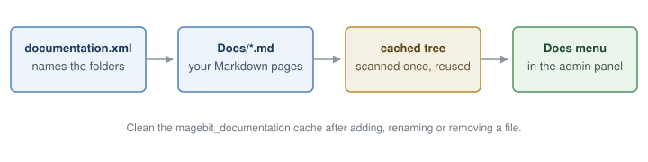
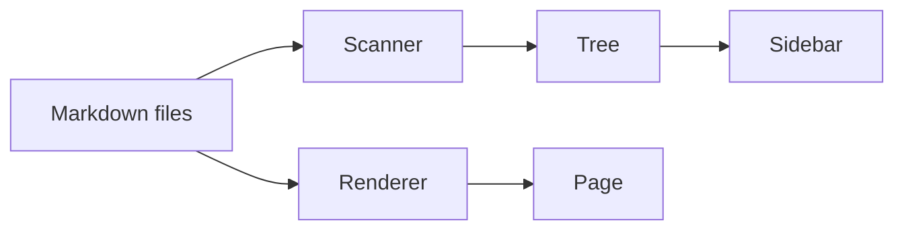

# Writing documentation

Pages are plain Markdown files. The folder they sit in becomes the tree, and the file name decides
both the label and the order.

## Folder and file names

```
Docs/
├── index.md              → Overview, always first
├── 1-getting-started.md  → Getting Started
├── 2-configuration.md    → Configuration
└── advanced/             → Advanced
    ├── index.md          → Overview
    └── 1-api.md          → Api
```

- A leading number followed by `-` or `_` sets the order and is stripped from the label.
- `-` and `_` become spaces, and every word is capitalised.
- `index.md` and `readme.md` are the overview of their folder: labelled **Overview**, sorted first.
- Sub-folders become collapsible categories, named by the same rules, up to ten levels deep.
- Anything that is not a `.md` file is not a page. Images still work — see below.

## Front matter

A YAML block at the very top of a file overrides what the file name decided.

```markdown
---
title: Getting started with orders
order: 20
---

# Getting started
```

| Key | Type | Effect |
|-----|------|--------|
| `title` | string | Replaces the label taken from the file name. A blank value is ignored. |
| `order` | integer | Replaces the number in front of the file name. |

`order` has to be an **unquoted integer**. `order: "20"` is a string, and a string is rejected — the
page keeps the order its file name gave it and a warning naming the key and the file goes to the
system log. So write this:

```markdown
---
order: 20
---
```

and never this:

```markdown
---
order: "20"
---
```

Only the first 8 KB of a file is read looking for front matter, so the block has to be at the top.

## Formatting

CommonMark with GitHub Flavored Markdown: headings, lists, tables, task lists, strikethrough and
autolinks all work. Every heading gets a link of its own, and the headings on a page fill the
**On this page** panel beside the text.

Raw HTML written into a page is stripped rather than rendered, and links using an unsafe scheme are
dropped. A link that leaves the site opens in a new tab and carries a small arrow after its text.

## Callouts

A blockquote that opens with one of GitHub's markers becomes a coloured box with a title:

```markdown
> [!NOTE]
> Useful background the reader can skip.

> [!TIP]
> A shortcut or a better way to do it.

> [!IMPORTANT]
> Something the reader has to know to succeed.

> [!WARNING]
> Something that can go wrong.

> [!CAUTION]
> Something that breaks things or loses data.
```

> [!NOTE]
> Useful background the reader can skip.

> [!TIP]
> A shortcut or a better way to do it.

> [!IMPORTANT]
> Something the reader has to know to succeed.

> [!WARNING]
> Something that can go wrong.

> [!CAUTION]
> Something that breaks things or loses data.

Everything the blockquote holds stays inside the box — lists, code and links included. A blockquote
without a marker, or with a marker nobody knows, is shown as an ordinary quote.

## Footnotes

```markdown
The index is rebuilt on every cache flush[^1].

[^1]: Only the `magebit_documentation` cache matters here.
```

The index is rebuilt on every cache flush[^1]. The notes are collected at the end of the page, each
one linking back to where it was used.

[^1]: Only the `magebit_documentation` cache matters here.

## Linking to another page

A relative link that ends in `.md` is rewritten to point at that page inside the viewer.

```markdown
See [registering documentation](2-registering-documentation.md).
```

A relative link **without** an extension is left exactly as it is — `[see](configuration)` is not
turned into `configuration.md`. Add the extension.

Absolute URLs, `mailto:` links and plain `#anchors` are passed through untouched.

## Images

Images are served by an admin controller straight off disk, so there is no static content deploy to
run and no `pub/media` copy to make.

```markdown

```

The path is resolved relative to the page, and the file has to stay **inside the section folder**. A
path pointing above it with `..` is refused with a 404. Allowed types are `png`, `jpg`, `jpeg`, `gif`,
`svg` and `webp`, up to 8 MB each. An SVG is served under a strict content security policy, so keep it
self-contained — anything it tries to pull in from elsewhere will not load.

Clicking an image opens it full screen; click again or press Escape to close it.

## Code blocks

Fenced blocks are highlighted in the browser. Give the fence a language name:

```php
<?php

declare(strict_types=1);

namespace Vendor\Module\Model;

use Magebit\Documentation\Api\SearchIndexInterface;

class DocumentationSearch
{
    public function __construct(
        private readonly SearchIndexInterface $searchIndex
    ) {
    }

    /**
     * Page titles matching a query, best match first.
     *
     * @param string $query
     * @return list<string>
     */
    public function titles(string $query): array
    {
        return array_map(
            static fn ($hit): string => $hit->getTitle(),
            $this->searchIndex->search($query, 5)
        );
    }
}
```

The common languages — php, javascript, json, xml, yaml, sql, bash, css, diff, ini, markdown and
about twenty more — are built in. `dockerfile`, `nginx` and `twig` ship as separate files and are
fetched the first time a page needs them.

A language nothing knows is shown as plain text and a warning appears in the browser console. Add it
under **Extra Languages** in the configuration if you want it loaded up front.

To show a fenced block inside a fenced block, wrap the outer one in four backticks:

````markdown
```php
echo 'this stays inside the outer block';
```
````

## Diagrams

A fenced block with the language `mermaid` is drawn in the browser with [Mermaid](https://mermaid.js.org/),
which ships inside the module — nothing is fetched from the internet.

````markdown

````


Flowcharts, sequence diagrams, class diagrams, state diagrams, entity relationships, Gantt charts and
the other Mermaid diagram types all work. A diagram that Mermaid cannot read keeps its source visible
under a short message, so the page is never left with a hole in it. Click a drawn diagram to see it
full screen.

Mermaid is large, so it is only loaded on pages that contain a diagram.
